# Navbar Design Practice — 15 Projects

Each thumbnail below is a live preview screenshot. Click any image to open that project's actual code (HTML/CSS/JS) in this repo.

| | | |
|---|---|---|
| [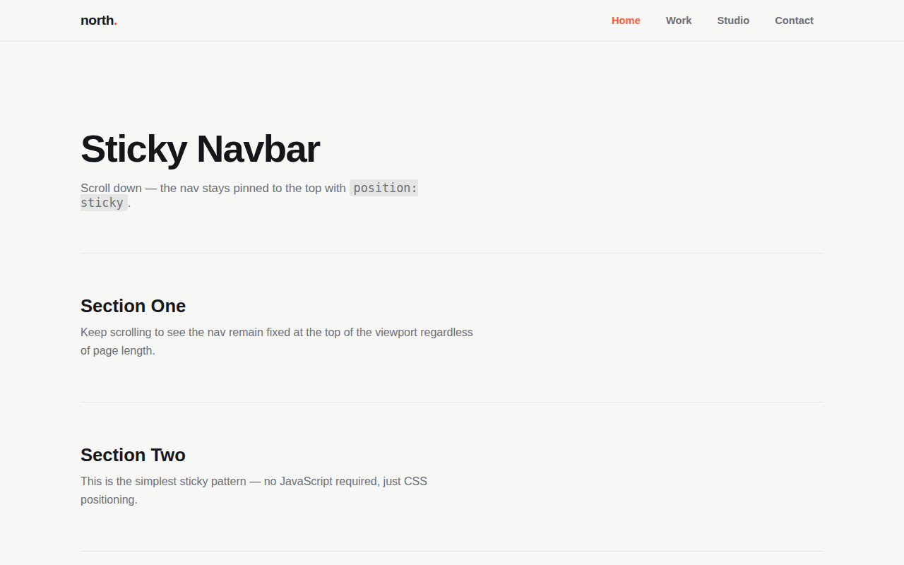](sticky-navbar)   **Sticky Navbar** · Easy | [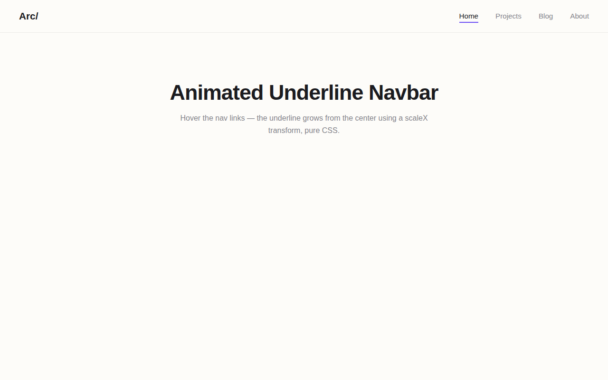](animated-underline-navbar)   **Animated Underline Navbar** · Easy | [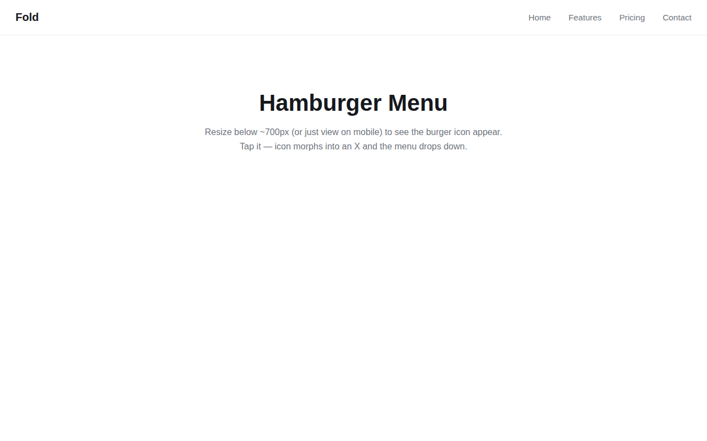](hamburger-menu)   **Hamburger Menu** · Easy |
| [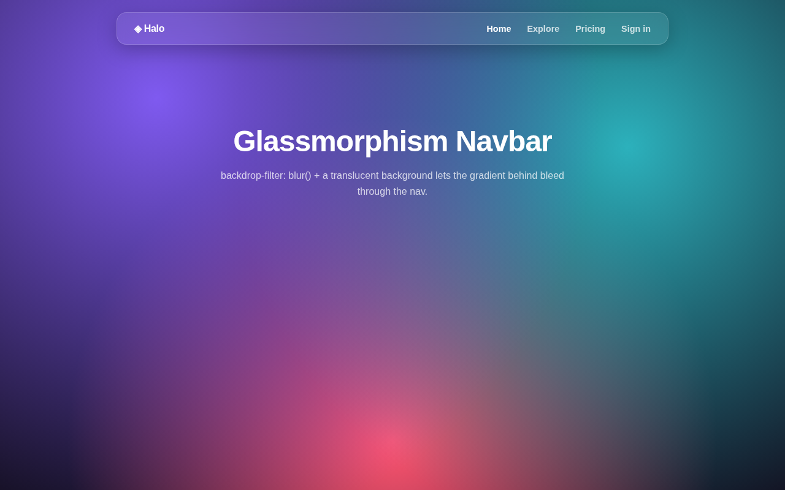](glassmorphism-navbar)   **Glassmorphism Navbar** · Easy-Medium | [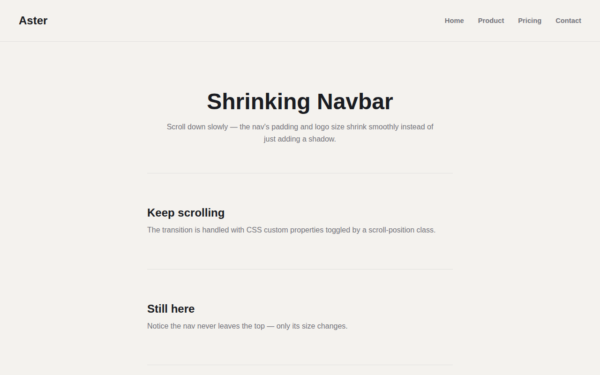](shrinking-navbar)   **Shrinking Navbar** · Medium | [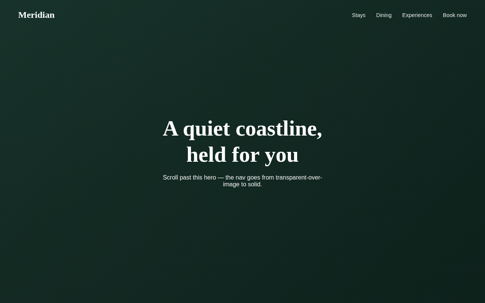](transparent-to-solid-navbar)   **Transparent to Solid Navbar** · Medium |
| [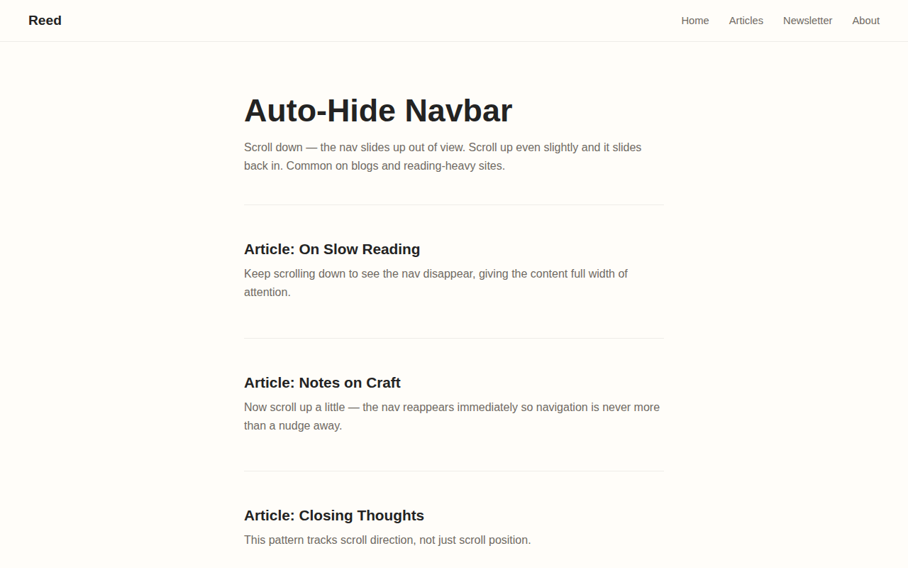](auto-hide-navbar)   **Auto-Hide Navbar** · Medium | [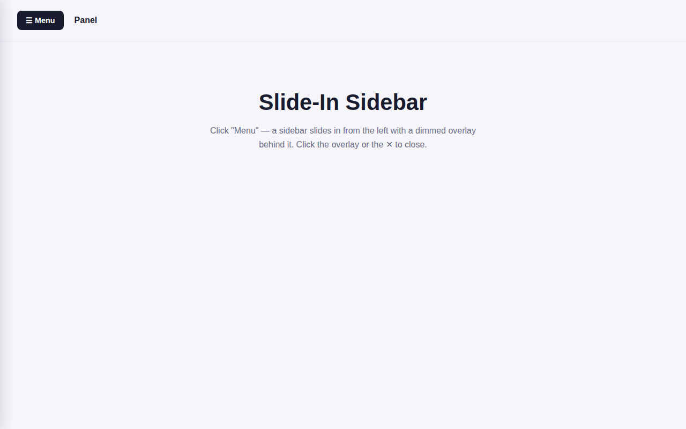](slide-in-sidebar)   **Slide-In Sidebar** · Medium | [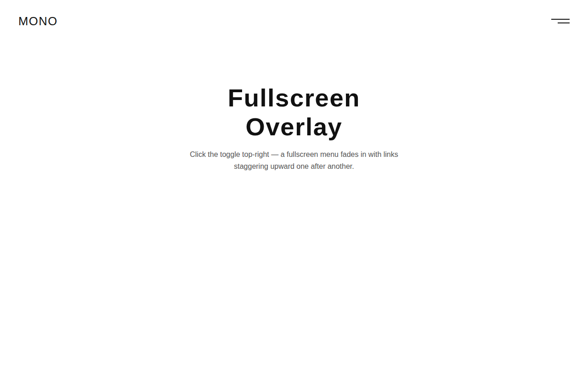](fullscreen-overlay)   **Fullscreen Overlay** · Medium |
| [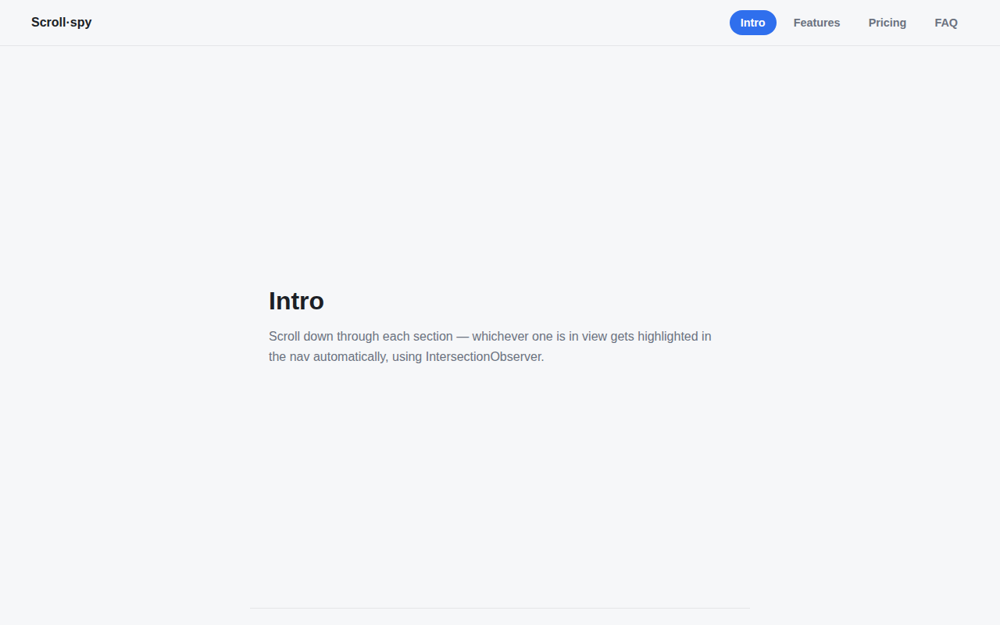](active-section-highlight)   **Active Section Highlight** · Medium | [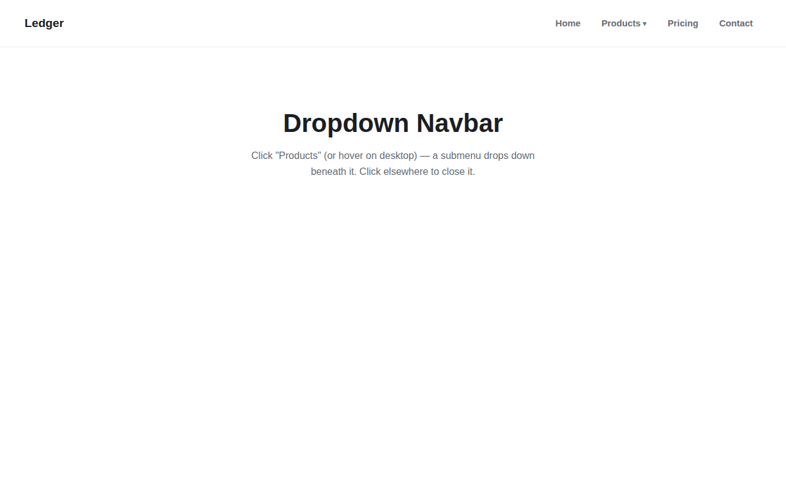](dropdown-navbar)   **Dropdown Navbar** · Medium | [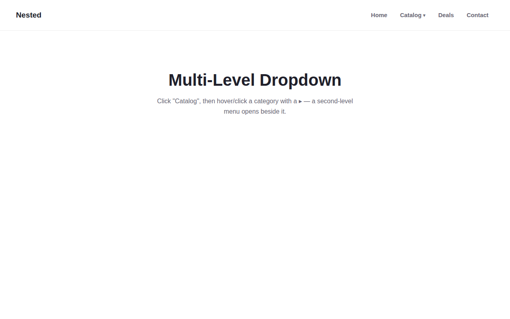](multi-level-dropdown)   **Multi-Level Dropdown** · Medium-Hard |
| [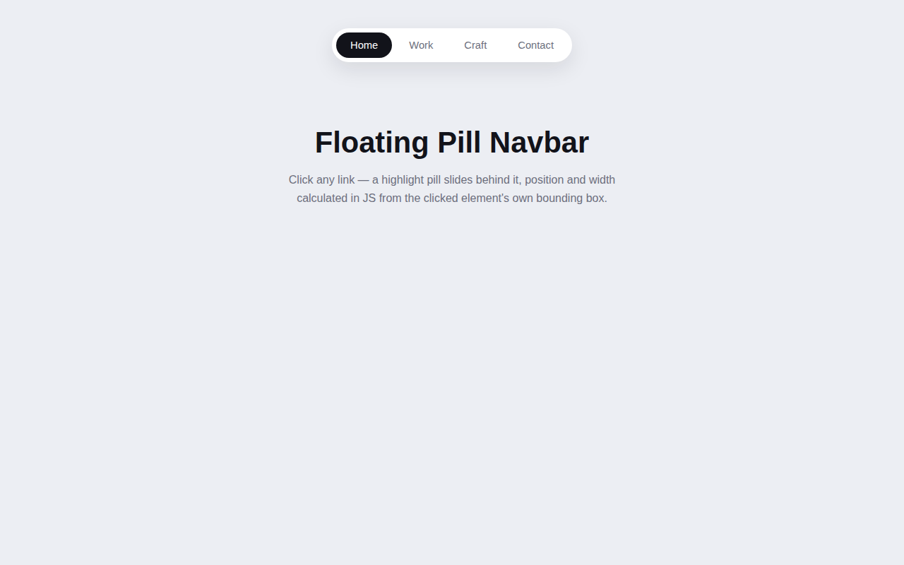](floating-pill-navbar)   **Floating Pill Navbar** · Hard | [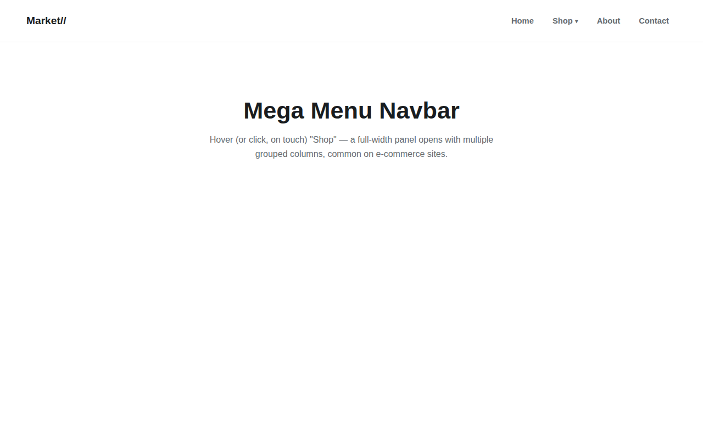](mega-menu-navbar)   **Mega Menu Navbar** · Hard | [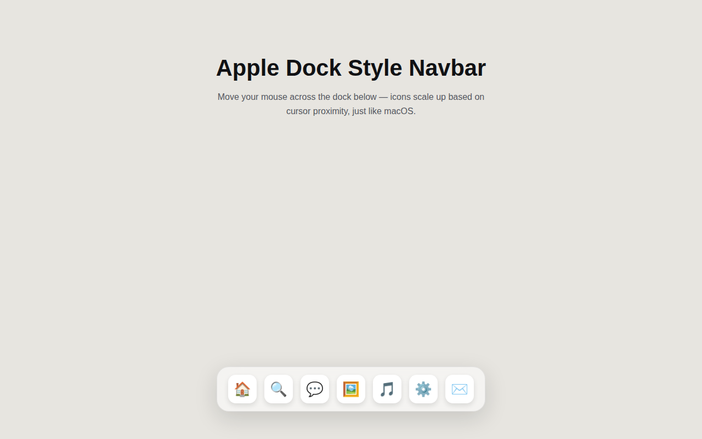](apple-dock-navbar)   **Apple Dock Style Navbar** · Hard |

Each folder is a standalone HTML/CSS/JS project — no build step, just open `index.html` in a browser.

> Note: screenshots show the default/closed state. Interactive parts (dropdowns, sidebars, overlays) only show their motion when opened live — clone the repo or open the file locally to see those in action.